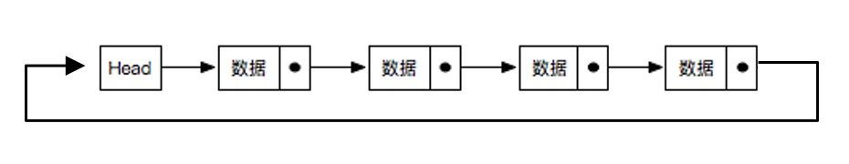
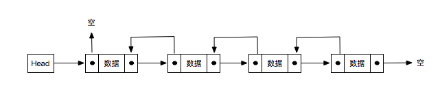
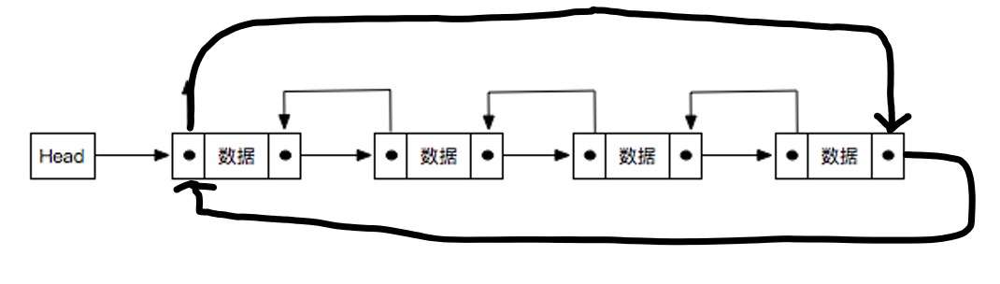

## **链表的定义**

链表是一种物理存储单元上非连续、非顺序的存储结构。链表由一系列结点组成，结点可以在运行时动态生成。每个结点包括两个部分：一个是存储数据元素的数据域，另一个是存储下一个结点地址的指针域。

## **常用方法**

+   `append(data)`：在链表尾部插入新结点
+   `insert(position,data)`：在指定位置插入结点
+   `removeAt(position)`：通过指定位置删除结点
+   `indexOf(data)`：返回结点在链表中所处的位置
+   `remove(data)`：删除链表中的结点
+   `isEmpty()`：判断链表中是否包含结点，是则返回`true`，否则返回`false`
+   `indexOf(data)`：返回结点在链表中所处的位置
+   `size()`：返回链表中的结点个数，方法和`length`类似

##  **链表分类**

###   单向链表

用一组任意的内存空间去存储数据元素，每个节点(node)都由数据本身和一个指向后续节点的指针组成，整个链表的存取必须从头指针开始，头指针指向第一个节点，最后一个节点的指针指向空（NULL）。


模拟实现

```js
// 节点类
class Node {
    constructor(data) {
        this.data = data
        this.next = null
    }
}
// 链表类
class LinkList {
    constructor() {
        //头部节点
        this.head = null
        //尾部节点
        this.tail= null
        // 长度
        this.length = 0
    }
    // 追加节点
    append(data) {
        let newNode = new Node(data)
        // 判断当前列表是否为空
        if (this.head == null) {
            this.head = newNode
        } else {
            // 寻找尾部节点(若链表不存在尾部节点属性)
            // let current = this.head
            // while (current.next != null) {
            //     current = current.next
            // }
            // // 将尾部节点的next指向新节点
            // current.next = newNode

            this.tail.next = newNode
        }
        this.tail = newNode
        this.length++
    }

    // 插入结点
    insert(position, data) {
        // 判断位置是否非法
        if (position < 0 || position > this.length)
            return false
        let newNode = new Node(data)
        if (position === 0) {
            if(this.length === 0){
                this.head = newNode
                this.tail = newNode
            }else{
                newNode.next = this.head
                this.head = newNode
            }
        } else if (position === this.length) {
            this.tail.next = newNode
            this.tail = newNode
        }
        else {
            let index = 0
            let current = this.head
            while (index++ < position - 1) {
                current = current.next
            }
            newNode.next = current.next
            current.next = newNode
        }

        this.length++
        return true
    }
    //根据指定位置删除结点
    removeAt(position) {
        // 判断位置是否非法
        if (position < 0 || position > this.length - 1)
            return false
        let current = this.head
        if (position === 0) {
            if(this.length === 1){
                this.head = null
                this.tail = null
            }else{
                this.head = current.next
            }
        } else {
            let index = 0;
            while(index++ < position - 1){
                current = current.next;
            }
            current.next = current.next.next;
            if(index === this.length-1){
                this.tail = current
            }
        }
        this.length--
        return true
    }
    //根据结点值查找结点所在链表位置
    indexOf(data) {
        let index = 0
        let current = this.head
        while (current) {
            if (current.data === data) {
                return index
            }
            current = current.next
            index++
        }
        return -1
    }
    //根据结点值删除链表中的该结点
    remove(data) {
        let position = this.indexOf(data)
        return this.removeAt(position)
    }
    //判空
    isEmpty() {
        return this.head == null
    }
    //长度
    size() {
        return this.length
    }
    //打印链表
    toString() {
        let print = ''
        let current = this.head
        while (current != null) {
            print += "," + current.data
            current = current.next
        }
        return print.slice(1)
    }

}
```

###   单向循环链表

在单向链表的基础上，最后一个节点的的指针指向链表头部，而不是NULL。


模拟实现

```js
// 节点类
class Node {
    constructor(data) {
        this.data = data
        this.next = null
    }
}

class LoopLinkList {
    constructor() {
        this.head = null
        this.tail = null
        this.length = 0
    }
    // 追加节点
    append(data) {
        //  创建新节点
        let newNode = new Node(data)

        if (this.head == null) {
            this.head = newNode
            //结点next指针指向头部结点
            newNode.next = this.head
        } else {
            let current = this.head
            while (current.next !== this.head) {
                current = current.next
            }
            current.next = newNode
            newNode.next = this.head
        }
        this.tail = newNode
        this.length++
        return true
    }

    insert(position, data) {
        // 判断位置是否非法
        if (position < 0 || position > this.length)
            return false
        let newNode = new Node(data)
        if (position === 0) {
            if (this.head == null) {
                this.head = newNode
                this.tail = newNode
                newNode.next = this.head
            } else {
                // let current = this.head
                // while (current.next !== this.head) {
                //     current = current.next
                // }
                //
                // newNode.next = this.head
                // current.next = newNode
                // this.head = newNode
                newNode.next = this.head
                this.head = newNode
                this.tail.next = newNode
            }
        } else if (position === this.length){
            this.tail.next = newNode
            newNode.next = this.head
        }
        else {
            //待优化
            let index = 0
            let current = this.head
            while (index++ < position - 1) {
                current = current.next
            }

            newNode.next = current.next
            current.next = newNode
        }
        this.length++
        return true
    }

    removeAt(position) {
        // 判断位置是否非法
        if (position < 0 || position > this.length - 1)
            return false
        if (position === 0) {
            if (this.length === 1) {
                this.head = null
                this.tail = null
            } else {
                // let current = this.head
                // while (current.next !== this.head) {
                //     current = current.next
                // }
                // current.next = this.head.next
                // this.head = this.head.next
                this.tail.next = this.head.next
                this.head = this.head.next
            }
        }else {
            let index = 0
            let current = this.head
            let previous = null
            while (index++ < position ) {
                previous = current
                current = current.next
            }
            previous.next = current.next
            if(position === this.length-1){
                this.tail = previous
            }
        }
        this.length--
        return true
    }
    indexOf(data){
        let index = 0;
        let current = this.head;
        while(current.next !== this.head){
            if(current.data === data){
                return index;
            }
            current = current.next;
            index++;
        }
        return current.data === data ? this.length - 1: -1;
    }
    //根据结点值删除链表中的该结点
    remove(data){
        let position = this.indexOf(data);
        this.removeAt(position);
    }
    //判空
    isEmpty(){
        return this.head == null;
    }
    //长度
    size(){
        return this.length;
    }
    //打印链表
    toString(){
        if(this.head != null){
            let print = '';
            let current = this.head;
            while(current.next !== this.head){
                print += ',' + current.data;
                current = current.next;
            }
            print += ',' + current.data;
            return print.slice(1);
        }
        return null;
    }
}
```

###   双向链表

双向链表在单向链表的基础上每个节点都有一个指向上一个节点的指针(prev)与指向下一个节点的指针(next)。


模拟实现

```js
class DoublyNode {
    constructor(data) {
        this.data = data
        this.next = null
        this.prev = null
    }
}

class TwoWayLinkList {
    constructor() {
        //头部结点
        this.head = null
        //尾部节点
        this.tail = null
        this.length = 0
    }
    append(data) {
        let newNode = new DoublyNode(data)
        // 空链表处理
        if (this.head == null) {
            this.head = newNode
            this.tail = newNode
        } else {
            this.tail.next = newNode
            newNode.prev = this.tail
            this.tail = newNode
        }
        this.length++
    }

    insert(position, data) {
        if (position < 0 || position > this.length)
            return false
        let newNode = new DoublyNode(data)
        if (position === 0) {
            //空链表
            if (this.head == null) {
                this.head = newNode
                this.tail = newNode
            } else {
                //非空链表
                newNode.next = this.head
                this.head.prev = newNode
                this.head = newNode
            }
        } else if (position === this.length) {
            //链表尾部插入
            this.tail.next = newNode
            newNode.prev = this.tail
            this.tail = newNode
        } else {
            //链表中间插入
            let index = 0
            let current = this.head
            while (index++ < position) {
                current = current.next
            }
            // 将新节点放在当前节点的前面
            newNode.next = current
            newNode.prev = current.prev
            current.prev.next = newNode
            current.prev = newNode
        }
        this.length++
        return true
    }

    // 删除某个位置上的节点 removeAt
    removeAt(position) {
        // 判断位置是否非法
        if (position < 0 || position > this.length - 1)
            return false
        //链表头部删除
        if (position === 0) {
            // 只有一个节点
            if (this.length === 1) {
                this.head = null
                this.tail = null
            } else {
                //当前头部的下一个结点的前置指针置空
                this.head.next.prev = null
                this.head = this.head.next
            }
        } else if (position === this.length - 1) { //链表尾部删除
            this.tail.prev.next = null
            this.tail = this.tail.prev
        } else { // 中间部分进行删除
            // 可以根据position的落点在前半截还是在后半截，进行删除遍历的判断(从前开始还是从后开始)
            if(position < Math.floor(this.length / 2)){
                let index = 0;
                let current = this.head;
                while (index++ < position) {
                    current = current.next;
                }
                current.prev.next = current.next;
                current.next.prev = current.prev;
            }else{
                let index = this.length - 1;
                let current = this.tail;
                while (index-- > position) {
                    current = current.prev;
                }
                current.prev.next = current.next;
                current.next.prev = current.prev;
            }
        }
        this.length--
        return true
    }
    indexOf(data) {
        let index = 0
        let current = this.head
        while (current) {
            if (current.data === data) {
                return index
            }
            current = current.next
            index++
        }
        return -1

    }
    // 删除某个元素节点 remove
    remove(data){
        let position = this.indexOf(data);
        return this.removeAt(position);
    }
    isEmpty() {
        return this.head == null;
    }
    size() {
        return this.length;
    }
    //正向遍历链表
    forwardTraversal() {
        let print = '';
        let current = this.head;
        while (current) {
            print += ',' + current.data;
            current = current.next;
        }
        return print.slice(1);
    }
    //反向遍历链表
    reverseTraversal() {
        let print = '';
        let current = this.tail;
        while (current) {
            print += ',' + current.data;
            current = current.prev;
        }
        return print.slice(1);
    }
}
```

###   双向循环链表

在双向链表的基础上，最后一个节点的后指针指向头结点，头结点的前指针指向尾部节点。


模拟实现

```js
class Node {
    constructor(data) {
        this.data = data
        this.next = null
        this.prev = null
    }
}
class TwoWayLoopLinkList {
    constructor() {
        this.head = null
        this.tail = null
        this.length = 0
    }
    append(data) {
        let newNode = new Node(data)
        if (this.head === null) {
            this.head = newNode
            this.tail = newNode
            newNode.next = this.head
            newNode.prev = this.tail
        } else {
            newNode.next = this.head
            newNode.prev = this.tail
            this.tail.next = newNode
            this.head.prev = newNode
            this.tail = newNode
        }
        this.length++
        return true
    }
    insert(position, data) {
        if (position < 0 || position > this.length)
            return false
        let newNode = new Node(data)
        if (position === 0) {
            //头部插入
            if (this.head == null) {
                this.head = newNode
                this.tail = newNode
                newNode.next = this.head
                newNode.prev = this.tail
            } else {
                newNode.next = this.head
                newNode.prev = this.tail
                this.head.prev = newNode
                this.tail.next = newNode
                this.head = newNode
            }
        } else if (position === this.length) {
            //尾部插入
            newNode.next = this.head
            newNode.prev = this.tail
            this.tail.next = newNode
            this.head.prev = newNode
            this.tail = newNode
        } else {
            let index = 0
            let current = this.head
            while (index++ < position) {
                current = current.next
            }
            newNode.next = current
            newNode.prev = current.prev
            current.prev.next = newNode
            current.prev = newNode

        }
        this.length++
        return true
    }
    removeAt(position) {
        if (position < 0 || position > this.length - 1)
            return false
        if (position === 0) {
            if (this.length === 1) {
                this.head = null
                this.tail = null
            } else {
                this.head.next.prev = this.tail
                this.tail.next = this.head.next
                this.head.next = null
                this.head.prev = null
                this.head = this.tail.next
            }
        } else if (position === this.length - 1) {
            this.tail.prev.next = this.head
            this.head.prev = this.tail.prev
            this.tail = this.tail.prev
        } else {
            let index = 0
            let current = this.head
            while (index++ < position) {
                current = current.next
            }
            current.prev.next = current.next
            current.next.prev = current.prev
        }
        this.length--
        return true
    }
    indexOf(data) {
        let index = 0
        let current = this.head
        while (current.next !== this.head) {
            if (current.data === data) {
                return index
            }
            current = current.next
            index++
        }
        return this.tail.data === data ? this.length - 1 : -1
    }
    remove(data) {
        let position = this.indexOf(data);
        return this.removeAt(position);
    }

    size() {
        return this.length;
    }
    forwardTraversal() {
        if (this.head !== null) {
            let print = '';
            let current = this.head;
            while (current.next !== this.head) {
                print += ',' + current.data;
                current = current.next;
            }
            print += ',' + current.data;
            return print.slice(1);
        }
        return false;
    }
    reverseTraversal() {
        if (this.head !== null) {
            let print = '';
            let current = this.tail;
            while (current.prev !== this.tail) {
                print += ',' + current.data;
                current = current.prev;
            }
            print += ',' + current.data;
            return print.slice(1);
        }
        return false;
    }
}
```