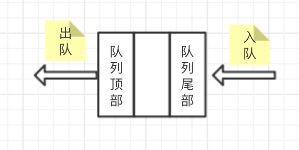
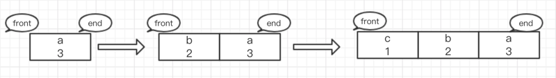

##  **队列的定义**

###  队列
队列与栈结构类似，队列是遵循先进先出原则的一组有序的项，与栈不同的是，栈不管是入栈还是出栈操作都是在栈顶操作。而队列则是在队尾添加元素，队顶移出。如下图所示：



模拟实现
```js
//队列
class Queue {
    constructor(props) {
        //初始化队列
        this.items = []
        //初始化队列长度
        this.length = 0
    }
    //入列
    enqueue(element) {
        this.length++
        this.items.push(element)
    }
    //出列
    dequeue() {
        this.length === 0 ? this.length = 0 : this.length--
        return this.items.shift()
    }
    //查看列头
    front() {
        return this.items[0]
    }
    //判断是否为空队列
    isEmpty() {
        return this.length === 0
    }
    //查看队列长度
    size() {
        return this.length
    }
    //查看整个队列
    print() {
        console.log(this.items);
    }
}
```

###  优先级队列
在队列的基础上，每个元素都会有各自的优先级，在插入的时候会根据优先级的高低顺序进行插入操作。入队时如果队列为空直接加入队列，否则进行比较，优先级越高（较小的数字具有较高优先级）的放在队列的越前面，如下图所示：



模拟实现
```js
//优先级队列
class PriorityQueue{
    constructor(props) {
        //初始化优先级队列
        this.items = []
        //初始优先级化队列长度
        this.length = 0
    }
    //生成优先级对垒元素
    queueElement(element,priority){
        return {
            element,
            priority
        }
    }
    //入队
    enqueue(element,priority){
        this.length++
        let queueElement = this.queueElement(element,priority),
            added = false
        for (let i = 0; i < this.items.length; i++) {
            if(queueElement.priority < this.items[i].priority){
                this.items.splice(i, 0, queueElement);
                added = true;
                break;
            }
        }
        if (!added) {
            this.items.push(queueElement);
        }
    }
    //出列
    dequeue() {
        this.length === 0 ? this.length = 0 : this.length--
        return this.items.shift()
    }
    //查看列头
    front() {
        return this.items[0]
    }
    //判断是否为空队列
    isEmpty() {
        return this.length === 0
    }
    //查看队列长度
    size() {
        return this.length
    }
    //查看整个队列
    print() {
        for (let ele of this.items) {
            console.log(`${ele.element} ${ele.priority}`);
        }
    }
}
```


##  **常用方法**
+   `enqueue(element)`：添加一个或者多个元素到队列尾部
+   `dequeue()`：移除队列的第一(即排在队列最前面的)项，并返回被移除的元素
+   `front()`：返回队列中第一个元素——最先被添加，也将是最先被移除的元素。队列不做任何改动
+   `isEmpty()`：判断队列中是否包含元素，是则返回`true`，否则返回`false`
+   `size()`：返回队列中的元素个数，方法和`length`类似

##  **运用场景**
###   约瑟夫环（丢手绢）

约瑟夫问题是个有名的问题：N个人围成一圈，从第一个开始报数，第M个将被杀掉，最后剩下一个，其余人都将被杀掉。例如N=6，M=5，被杀掉的顺序是：5，4，6，2，3。

可以将参与游戏的人压入队列中，从头开始报过数的人出队列，然后从队尾进入队列。当到报数序号时，将队列头部元素进行出列，循环直至最后一人。

模拟实现

```js
function JosephRing(names,num){
    let queue = new Queue(),
        time = 1,
        name = ''
    for(let name of names){
        queue.enqueue(name)
    }
    while (queue.size() > 1){
        console.log('执行了')
        for (let i = 0; i <num-1 ; i++) {
            queue.enqueue(queue.dequeue())
        }
        name = queue.dequeue()
        console.log(`第${time}轮，淘汰：${name}`)
        time++
    }
    console.log('最后获胜者：' + queue.front())
}
```

