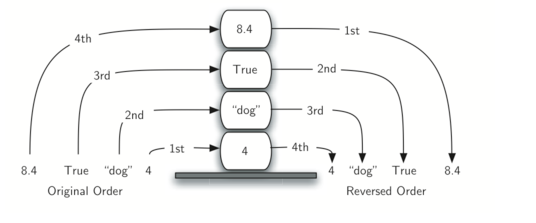

## 栈的定义

栈：栈是一种遵从后进先出（LIFO）原则的有序集合。如下图所示，先进去的数据在底部，最后取出，后进去的数据在顶部，最先被取出。



## 常用方法

+   `push(element)`：添加一个或者多个元素到栈顶
+   `pop()`：移除栈顶的元素，同时返回该元素
+   `peek()`：查看栈顶的元素
+   `isEmpty()`：判断栈是否空了，是则返回`true`，否则返回`false`
+   `clear()`：清除栈中的所有元素
+   `size()`：返回栈里的元素个数，方法和`length`类似

## 模拟实现
```js
class Stack {
    constructor(props) {
        //初始化栈
        this.items = []
        //初始化栈长度
        this.length = 0
    }

//入栈
    push(element) {
        this.items.push(element)
        this.length++
    }

//出栈
    pop() {
        this.length === 0 ? this.length = 0 : this.length--
        return this.items.pop()
    }

//查看栈顶元素
    peek() {
        return this.items[this.length - 1]
    }

//查看栈是否为空
    isEmpty() {
        return this.length === 0
    }

//清空栈
    clear() {
        this.items = []
        this.length = 0
    }

//查看栈元素长度
    size() {
        return this.length
    }
}
```

## 运用场景

###  进制转换

1.  已知 10 进制的数为 n。
2.  将 n 每次取余 2 的值放入栈底部。
3.  将 n 每次除于 2 的值当成下一次循环的数字（向下取整，舍弃小数部位）。
4.  循环步骤 2 和步骤 3，直至 n 等于 0 为止。
5.  将栈的数值依序推出来，从而得到最终结果。
    
+   代码实现
```js
/**
 * 十进制转换二进制
 * @param number
 * @returns {string}
 */
function decimalToBinary(number){
    let result = '',
        stack = new Stack(),
        rem
    while (number > 0){
        rem = Math.floor(number%2)
        stack.push(rem)
        number = Math.floor(number/2)
    }
    while (!stack.isEmpty()){
        result += stack.pop().toString()
    }
    return result
}
/**
 * 十进制转16、8、2进制
 * @param number
 * @param binary
 * @returns {string}
 */
function baseConversion(number,binary){
    let result = '',
        stack = new Stack(),
        rem,
        digits = '0123456789ABCDEF'
    while (number > 0){
        rem = digits[Math.floor(number%binary)]
        stack.push(rem)
        number = Math.floor(number/binary)
    }
    while (!stack.isEmpty()){
        result += stack.pop().toString()
    }
    return result
}
```

###  括号匹配

拿` ()[]{} `举例：
1.  判断 ( 不是闭合括号，所以推入栈，stack = [ '(' ]；
2.  判断 ) 是闭合括号，所以推出栈，stack = []；
3.  判断 [ 不是闭合括号，所以推入栈，stack = [ '[' ]；
4.  判断 ] 是闭合括号，所以推出栈，stack = []；
5.  判断 { 不是闭合括号，所以推入栈，stack = [ '{' ];
6.  判断 } 是闭合括号，所以推出栈，stack = []；
    
```js
/**
 * 利用栈结构，括号匹配
 * @param str
 * @returns {boolean}
 */
function bracketsMatch(str){
    let leftBrackets = '({[',
        rightBrackets = ')}]',
        stack = new Stack(),
        i = 0,
        result = true
    while (i < str.length){
        if(leftBrackets.includes(str[i])){
            stack.push(str[i])
        }else{
            let pop = stack.pop()
            if(pop !== leftBrackets[rightBrackets.indexOf(str[i])]){
                result = false
                break
            }
        }
        i++
    }
    if(!stack.isEmpty()){
        result = false
    }
    return result
}
```

###  判断回文

判断字符串是否为回文 如 'abcba'

```js
function isBackToText(str){
    let arr = str.split('');
    let stack = new Stack();
    for(let i = 0; i < arr.length; i++){
        stack.push(arr[i]);
    }
    let reverseStr = '';
    for(let i = 0; i < arr.length; i++){
        reverseStr += stack.pop();
    }
    return reverseStr === str
}

console.log(isBackToText('ABCCBA'))
console.log(isBackToText('ABCBA'))
console.log(isBackToText('123324'))
```